

# Mystics Civil

## The Construction Operations Cockpit

### From the first estimate to the final handover — one platform, one source of truth.

A pitch for forward-looking construction leaders

---

## The Problem We Solve

Construction runs on coordination. Today it leaks through the cracks.

| Where work breaks down | What it costs you |
|---|---|
| Daily progress lives in WhatsApp groups and paper registers | No live earned value; surprises at month-end |
| Bills, deductions and payments live in spreadsheets | TDS, retention, advances mis-applied; ledger never tied out |
| Approvals chase people over email and phone | Variations and bills sit for weeks; cash flow stalls |
| Quality and safety records are kept "for the file" | Audit failures; insurance claims rejected |
| Stores and procurement live in another system entirely | Stock-outs, double-ordering, vendor disputes |

> **Mystics Civil replaces every one of those leaks with a single platform — built for the way Indian construction actually works.**

---

## One Platform. Every Role. Every Decision.

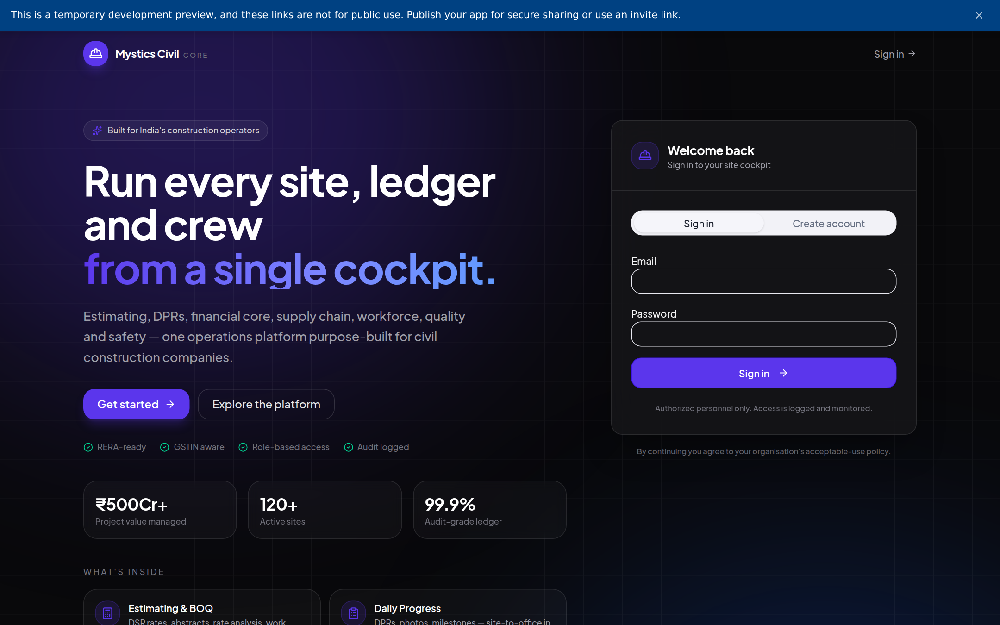

**Secure, role-based access** — every team member sees exactly what they need and nothing they don't. Built-in roles for Owner, PM, QS, Finance, Site Engineer, QC, Store, HR, Contractor — plus your own **custom roles** with hand-picked permissions.

---

## Executive Dashboard — Your Morning Briefing

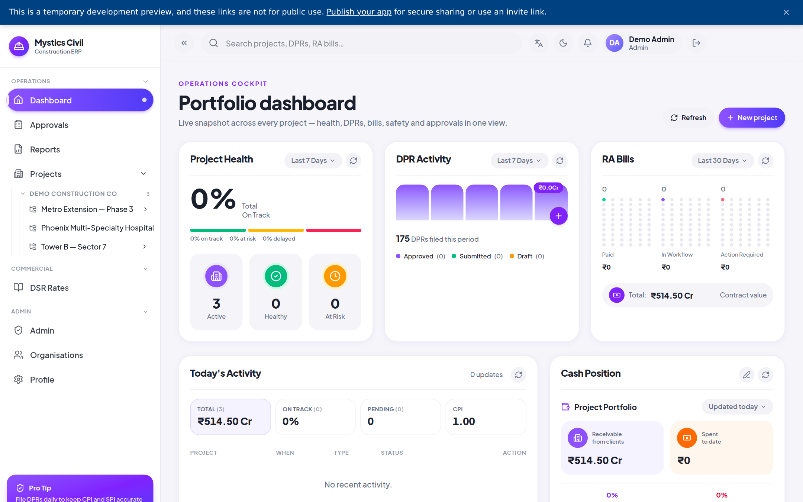

Live KPIs from across every project: active vs total, pending approvals, DPRs filed today, budget vs actual, schedule variance. **One screen tells the leadership team what needs their attention.**

---

## Projects — Plan, Run, Close

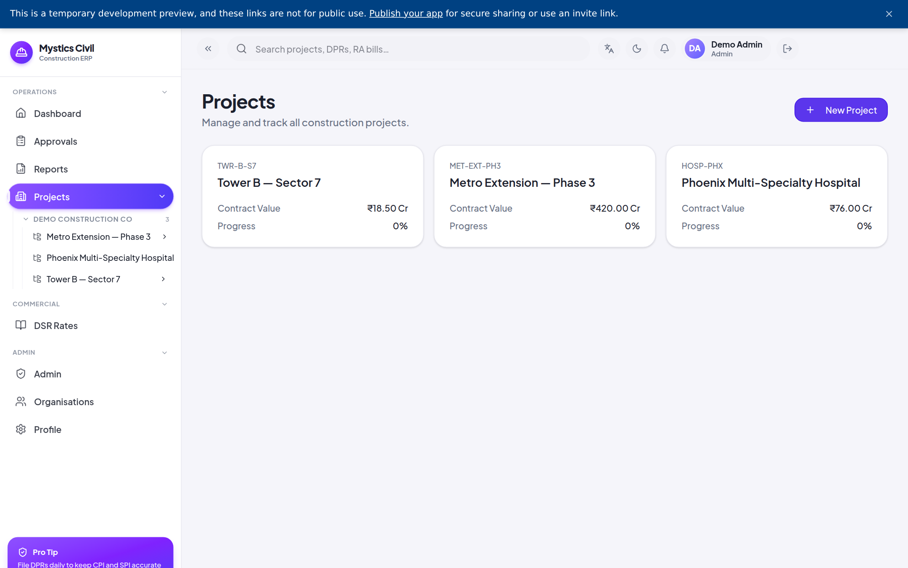

Every project carries a clear lifecycle: **Pending approval → Not started → On track / At risk / Delayed / On hold → Completed.** Each transition is logged and auditable. Quotas per organisation, automatic project-access grants, and one-click drill-down to any detail.

---

## Project Cockpit — Everything in One Place

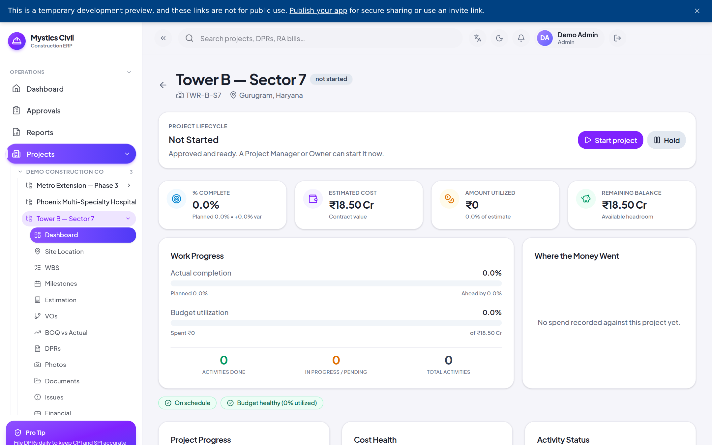

A tabbed cockpit for every project: WBS, Milestones, Estimation, VOs, BOQ-vs-Actual, DPRs, Photos, Documents, Issues, Financial, Supply Chain, Workforce, Settings — all gated by the modules that organisation enables.

---

## Site Location — Map-Aware Operations

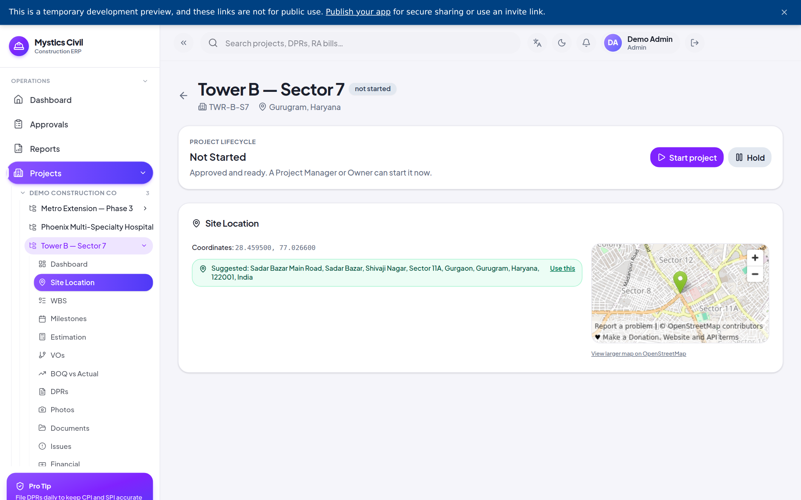

Every project pinned on a real map. Powers the **attendance geofence** — workers can only be marked present from within 200 metres of the site. No more remote mark-ups, no more disputed muster.

---

## Work Breakdown Structure — Live Earned Value

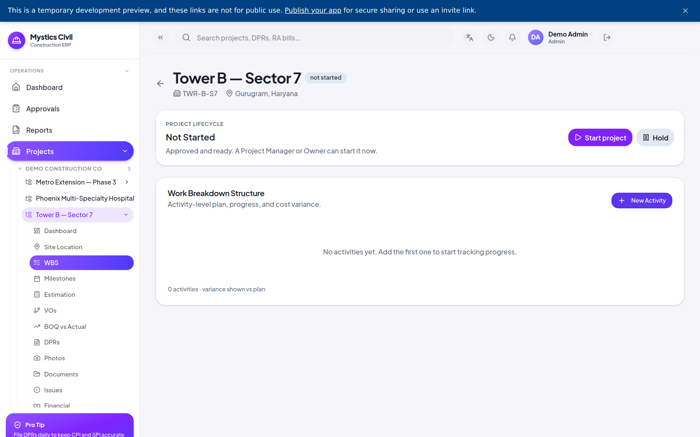

A hierarchical activity tree with planned and actual quantities. **Every approved Daily Progress Report updates the WBS automatically** — so earned value is always live, not a month-end report.

---

## Milestones — What Matters, When

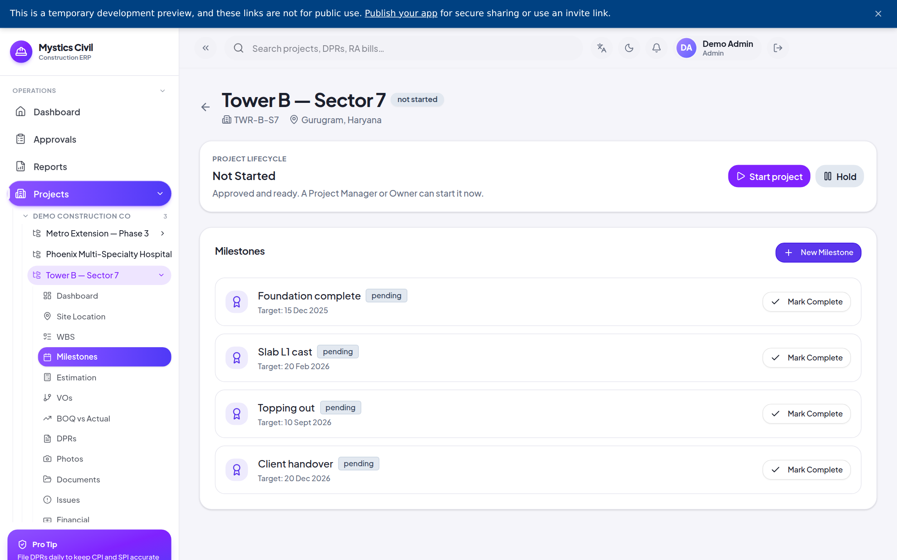

Critical-path milestones with health flags (on track, at risk, delayed, completed). Roll-up from the WBS gives leadership a one-glance answer to *"are we going to hit handover?"*

---

## Estimation — From L0 to L5, with Live Rates

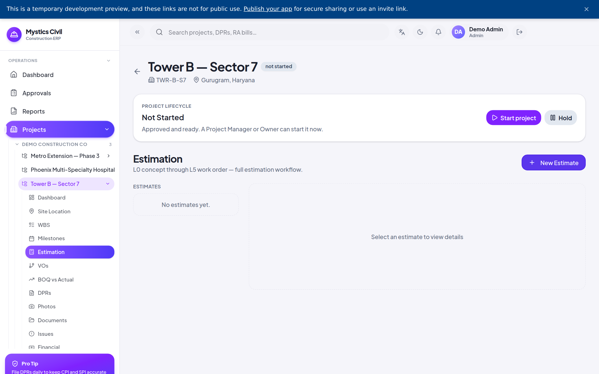

Five-level estimating ladder — order-of-magnitude through contract BOQ. Backed by a **rate library that refreshes itself nightly** from DSR, state schedules and your in-house catalogues. Bid with today's prices, not last quarter's.

---

## DSR & Rate Engine — Pricing on Autopilot

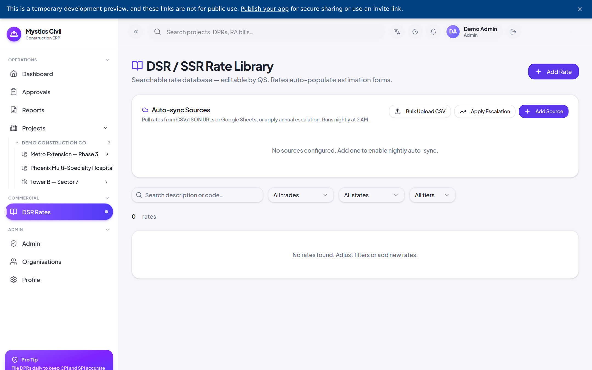

Plug in DSR, state schedules, vendor quotes, your own catalogues. A scheduled job runs **every night at 2 AM** to refresh every enabled source. Manual sync available any time. Estimates are always priced on current data.

---

## Variation Orders — Scope Change, Controlled

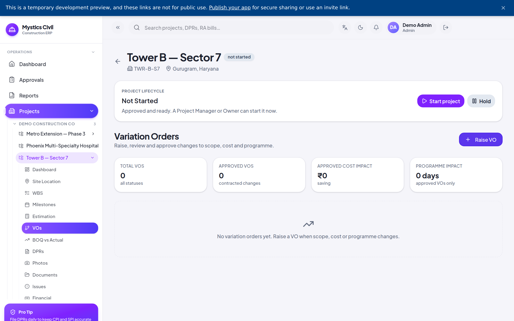

Draft → Submitted → Approved (or Rejected). Once approved, VOs flow automatically into BOQ-vs-Actual, contractor billing and client invoicing. Locked terminal states give you a clean paper trail for the client and the auditor.

---

## BOQ vs Actual — Money on the Floor

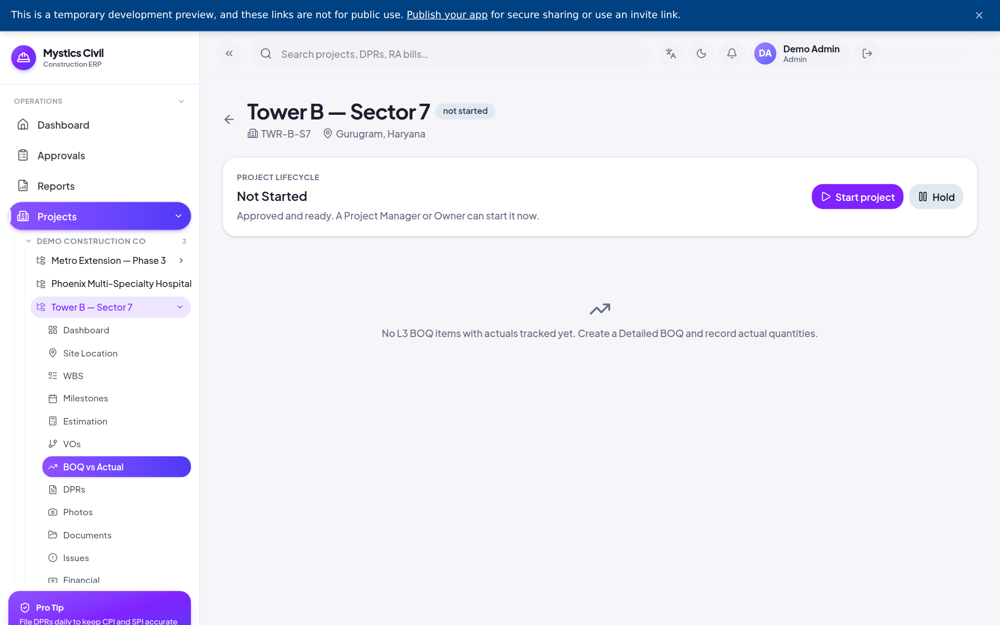

Live variance by cost head, drillable to the activity that's bleeding. Combine approved VOs with executed quantities to spot cost creep before it becomes a write-off.

---

## Daily Progress Reports — The Site's Heartbeat

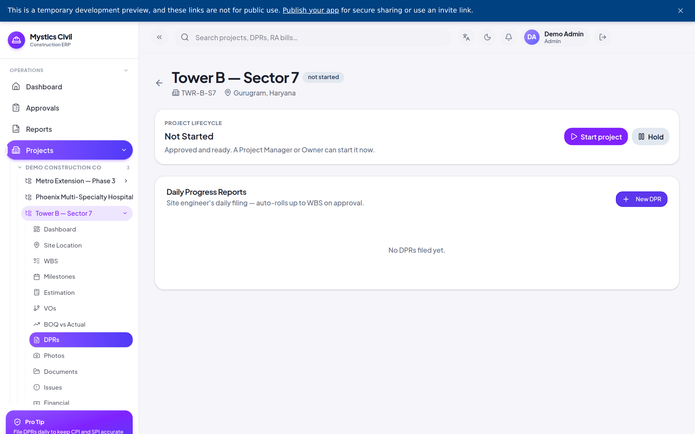

Site engineer drafts the day's report — manpower, weather, quantities, photos. Submits it. PM approves from the inbox. **Approved quantities post to the WBS in the same transaction.** No double entry. No reconciliation.

---

## Photos & Documents — Site Evidence That Sticks

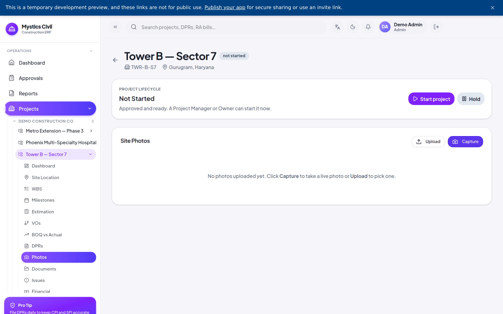

Geotagged site photos and versioned documents — drawings, contracts, certificates — stored securely and indexed by activity and date. Perfect for client updates, dispute resolution, and statutory audits.

---

## Issues — A Snag List That Closes

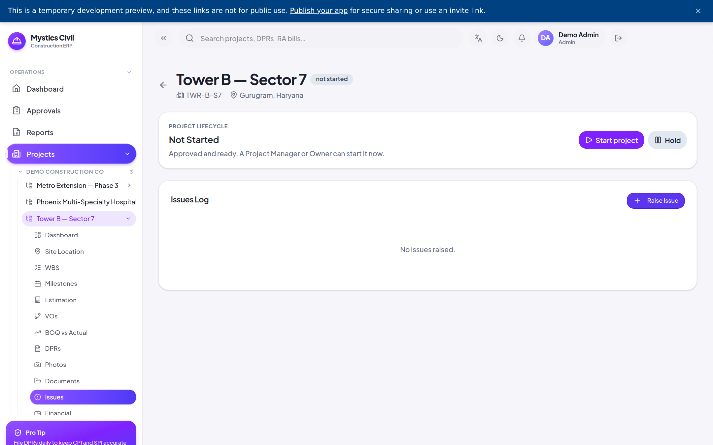

Anyone on site raises an issue (low → critical). It stays open until resolved, with a clear trail of who fixed it and when. No more snag-list spreadsheets that nobody updates.

---

## Finance — Bills, Deductions, Payments, Ledger

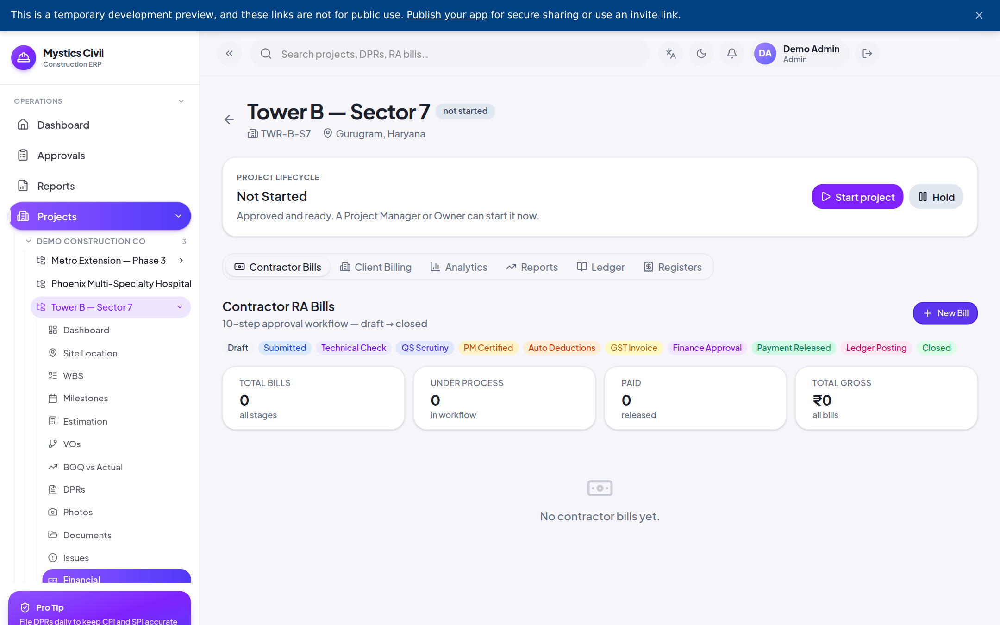

Contractor bills flow: **Draft → Verify → Certify → Approve → Pay.** On approval, the platform automatically applies **TDS, retention, labour welfare fund, and advance recovery**. GST registers. Ledger posts. Client invoicing mirrors the flow. **Zero manual journal entries.**

---

## Supply Chain — From Indent to Stock

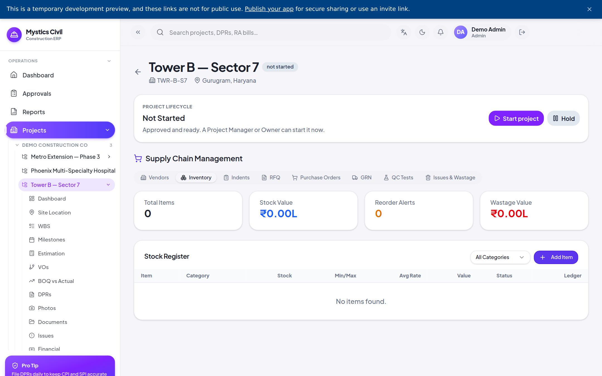

**Indent → RFQ → Vendor responses → Award → PO → GRN (with QC) → Stock.** Failed quality tests automatically open an NCR. Every stock movement is recorded in a permanent ledger. Rate contracts speed up repeat purchases.

---

## Workforce & EHS — People, Payroll, Quality, Safety

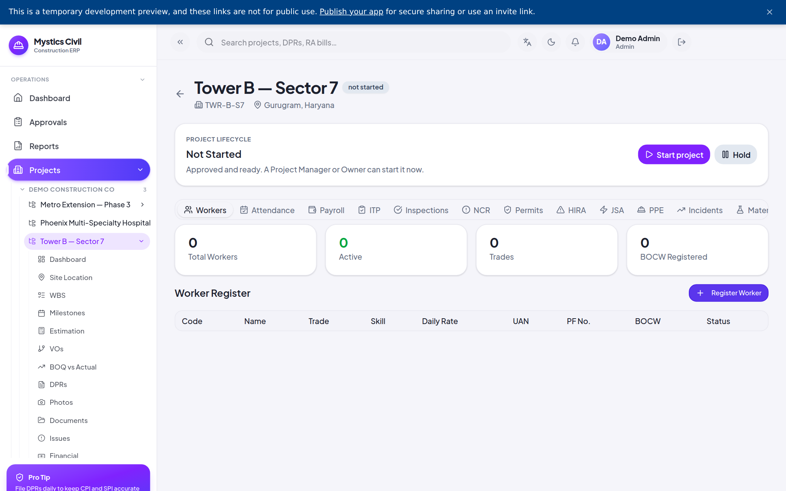

Worker master with BOCW, bank details and trade. Geofenced bulk attendance. Payroll periods that **compute then lock**. ITPs, NCRs with CAPA tracking. HIRA, JSA, permits, PPE issues, incidents. Everything OSHA and Indian-labour-law-compliant out of the box.

---

## Approvals Inbox — One Queue for Every Decision

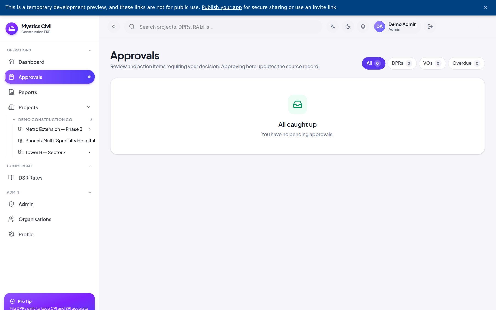

Projects, DPRs, VOs, contractor bills, labour bills, ITPs — every decision waiting for you, in **one inbox**. Approve or reject in one click; the underlying action happens in the same transaction. The end of WhatsApp escalations.

---

## Reports — Insight You Can Send

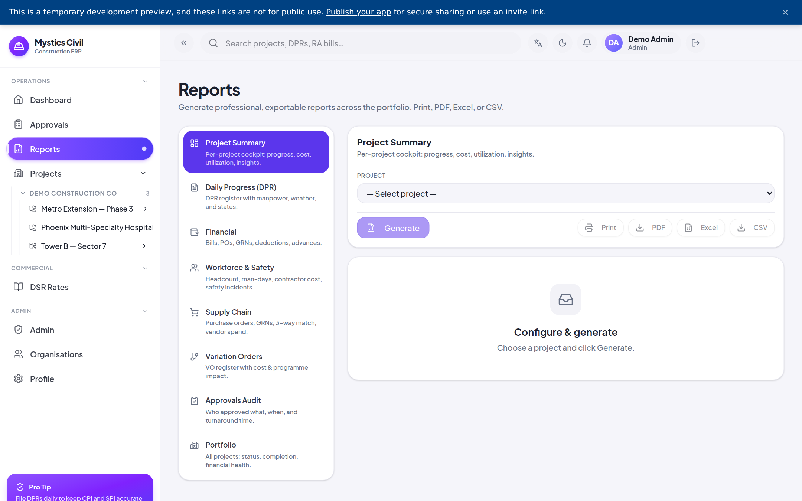

Exportable analytics for every audience: BOQ vs Actual, bill aging, GST and TDS summaries, attendance and payroll, project health, NCR registers, incident logs. CSV and PDF, ready for the client, the board, or the auditor.

---

## Administration — Total Control of Access

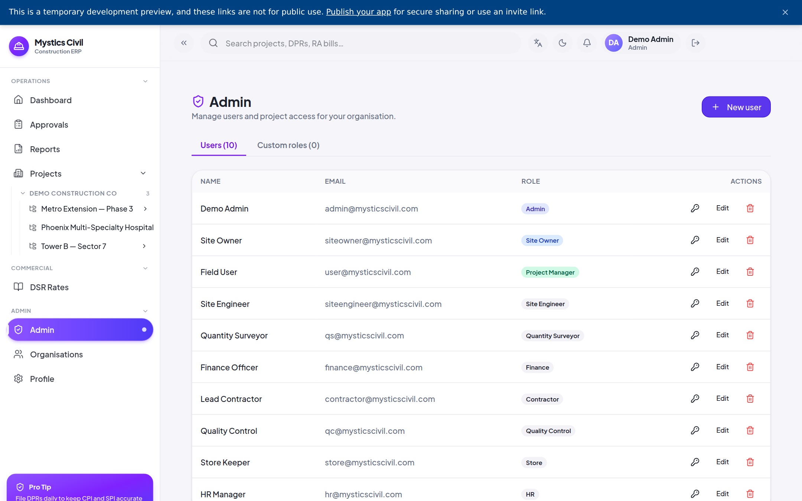

Users, built-in roles, **custom roles you design yourself**, organisations, project quotas, per-organisation and per-project module access. Everything you need to scale from a single site to a multi-region operation — and the only place a sensitive setting can change.

---

## Custom Roles — Permissions That Fit Your Team

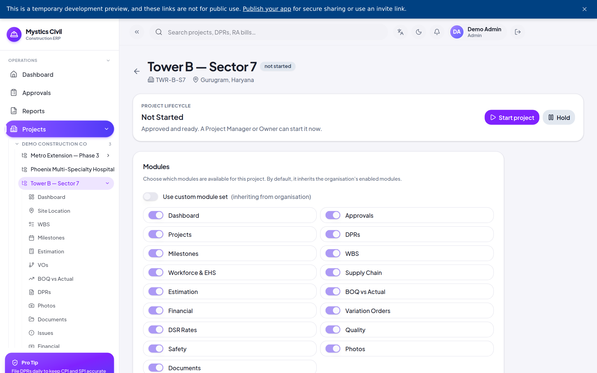

The 11 built-in roles aren't enough? **Build your own.** Pick capabilities from a checklist grouped by domain — Projects, Approvals, DPRs, Finance, Workforce, Supply Chain, Admin. Custom roles **add** to a user's built-in role — they never strip it. Your governance, your way.

---

## What Makes Mystics Civil Different

| Special feature | Why it matters |
|---|---|
| **Custom roles, additive on top of built-ins** | Governance fits your org chart, not the other way around. |
| **Automatic nightly rate refresh (DSR, state, in-house)** | Bid and estimate on today's prices — not last quarter's. |
| **Geofenced attendance** | Eliminate ghost workers; lock muster to the actual site. |
| **Unified Approvals Inbox** | One queue, every decision — projects, DPRs, VOs, bills, ITPs. |
| **Auto-deductions on bills** | TDS, retention, LWF, advance recovery — applied without human error. |
| **DPR → WBS in one transaction** | Earned value is live, not month-end. |
| **Module access per org *and* per project** | A small repair project hides the modules it doesn't need. |
| **Permanent audit trail on every record** | Every approval, every transition, forever. |
| **Indian construction defaults** | BOCW, EPF, ESI, GST, TDS 194C, retention — out of the box. |
| **Multi-tenant from day one** | Run multiple organisations from a single deployment. |

---

## A Project, End-to-End, in One Place

> **Day 0** — Admin sets up the org, creates users, defines a "Junior PM" custom role.
> **Week 1** — PM creates *Tower B, Sector 7*; owner approves from the inbox.
> **Week 2** — QS builds the L5 BOQ from the live DSR library; storekeeper raises indents; RFQs go to vendors.
> **Every day** — Site engineer marks attendance (geofence verified), files the DPR; PM approves it next morning; WBS updates instantly.
> **A failed cube test** — auto-opens an NCR; contractor submits CAPA; closed in 48 hours.
> **A scope change** — QS drafts a VO; owner approves; flows into billing automatically.
> **Running bill** — TDS, retention, advance all auto-applied; finance pays via NEFT; ledger posts itself.
> **Week 12** — HR runs payroll: compute → approve → release. Done.
> **Day H** — All approvals resolved, NCRs closed, retentions released on schedule. PM marks the project **Completed**. The record becomes a permanent, auditable history.

---

## Ready to See It Live?

### Mystics Civil — built to make construction operations **clear, controlled, and accountable.**

**Demo credentials are ready.** Pick a role and walk through your own project, end to end.

| Role | Login |
|---|---|
| Super Admin | superadmin@mysticscivil.com |
| Admin | admin@mysticscivil.com |
| Site Owner | siteowner@mysticscivil.com |
| Project Manager | user@mysticscivil.com |
| Site Engineer | siteengineer@mysticscivil.com |
| Quantity Surveyor | qs@mysticscivil.com |
| Finance | finance@mysticscivil.com |
| Quality Control | qc@mysticscivil.com |
| Storekeeper | store@mysticscivil.com |
| HR | hr@mysticscivil.com |
| Contractor | contractor@mysticscivil.com |

> Shared password: **MysticsCivil@2026**

Let's build something that finishes on time and within budget.

